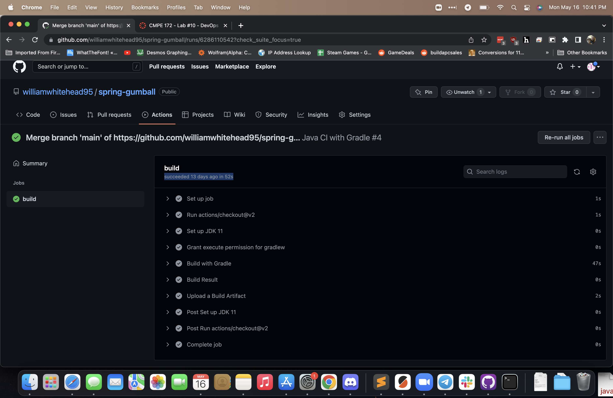

# CMPE 172 - Lab #10 Notes

# Gradle Github action

# Google Kubernetes Engine Github action

# Google Kubernetes Engine IAM policies

# GKE Secret Keys in Repo Secrets

# Google Kubernetes Engine IAM support

# GKE Integration Github support

# CI Workflow (Part 1)
I didn't have much trouble getting Gradle to build successfully with Github actions, although I was having some issue changing the permissions on ./gradlew. To resolve this, I changed the format of chmod from "chmod -x" to "chmod 777". While this gives additional permissions over simple execution permission, it allowed the rest of the action to run as expected.

# CI Workflow (Part 2)
I had significant issues making any headway on this section of the lab. I set myself the challenge of not relying on my classmates as resources in resolving the issue, and only utilized the lab documentation and official support documentation from Github and Google Cloud. However, I kept running into an error with trouble generating a federated token for Google Cloud. I ensured the project had an up to date Service Account secret key, and also reviewed the IAM policies on Google Cloud to ensure that service account had all necessary permissions for control and deployment within GKE. I also reviewed the build file to ensure I hadn't missed any default settings that needed to be changed=, but still was unable to ultimately resolve the issue.
